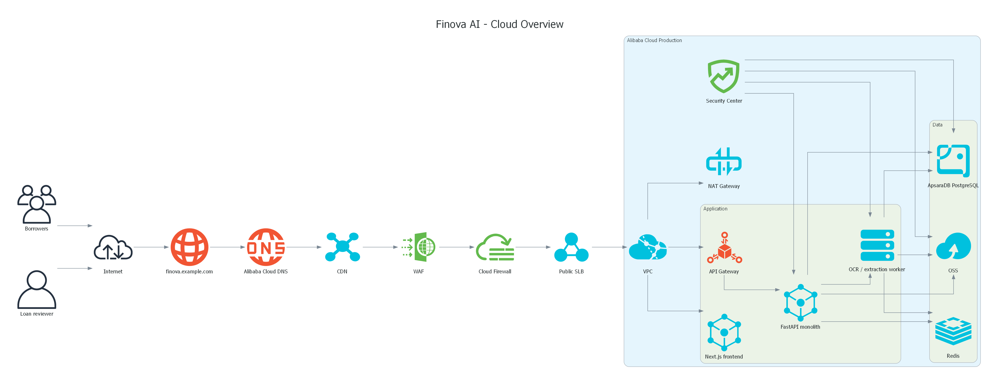
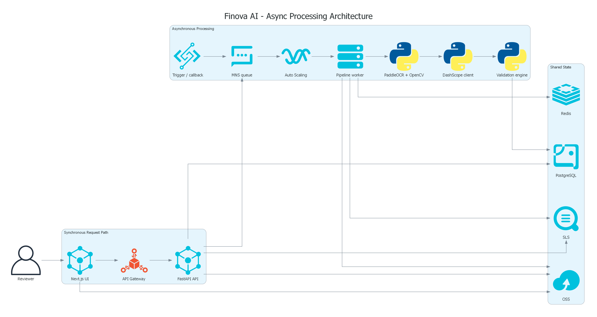
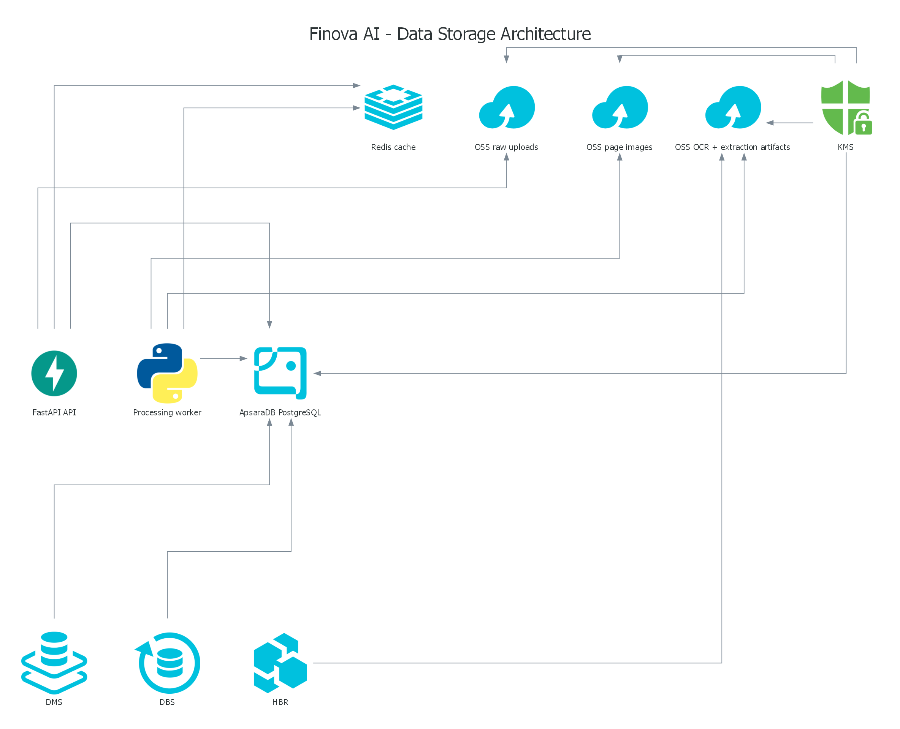
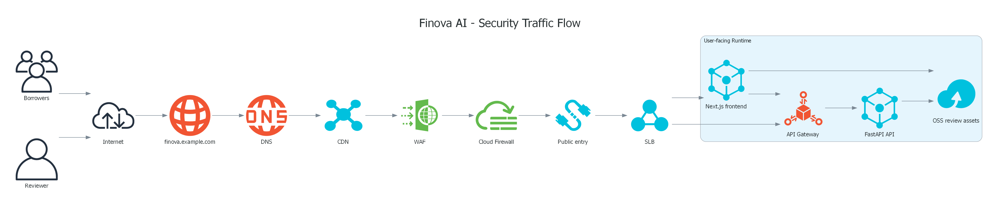
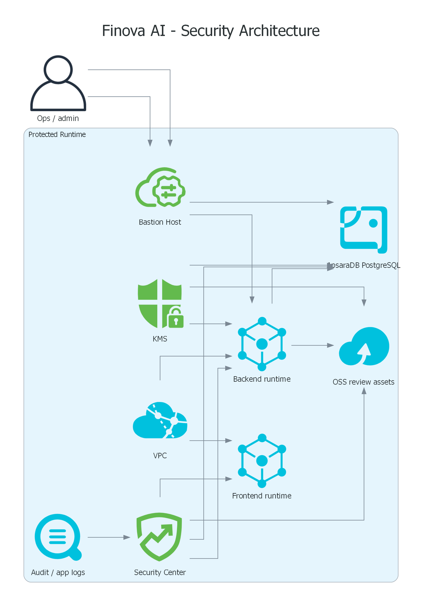
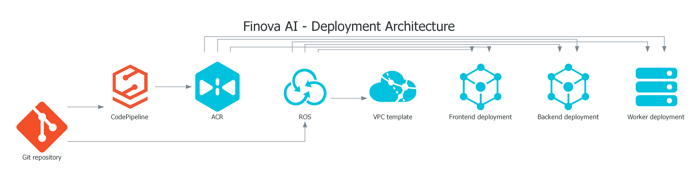

# Finova AI

Finova AI is an AI-powered document intelligence platform for loan verification and KYC workflows. It helps financial teams turn uploaded customer documents into structured, reviewable, and validated data using OCR, computer vision, and LLM-based extraction.

The product is designed around a practical intake-to-review flow rather than a generic OCR demo. The goal is to reduce manual verification time while keeping human reviewers in control of the final decision.

## Why Finova

Loan and KYC workflows are still heavily document-driven. ID cards, payslips, and bank statements often arrive in inconsistent formats and require repetitive manual review before they can support a lending decision.

Finova addresses that problem by combining document preprocessing, OCR, structured extraction, validation, and reviewer-facing verification into one platform. The result is a pipeline that is faster than manual handling, but still auditable and operationally trustworthy.

## What The Platform Does

- Accepts customer document uploads for verification workflows
- Normalizes PDF and image inputs into a consistent page-processing pipeline
- Uses OCR and computer vision to extract layout-aware text
- Converts unstructured content into structured JSON fields
- Runs validation rules to surface inconsistencies and missing information
- Supports human-in-the-loop review with persisted artifacts and review signals

## Supported Scope

The current MVP scope is intentionally narrow:

- Supported document types:
  - `id_card`
  - `payslip`
  - `bank_statement`
- Supported file formats:
  - `.jpg`
  - `.jpeg`
  - `.png`
  - `.pdf`
- Architecture baseline:
  - modular monolith
  - local Docker Compose development
  - cloud-oriented deployment design on Alibaba Cloud

## Core Tech Stack

- Frontend: Next.js
- Backend: FastAPI
- OCR: PaddleOCR
- Image processing: OpenCV
- Structured extraction: LLM with JSON-only output
- Database: PostgreSQL
- Object storage: MinIO for local development, OSS in cloud architecture views
- Cloud architecture target: Alibaba Cloud

## Cloud Architecture

The cloud documentation is organized as a multi-diagram set so each architectural concern can be understood independently without turning one image into a wall of lines.

### 1. Cloud Overview

High-level view of the production footprint on Alibaba Cloud, including edge entry, application services, worker tier, and core managed services.

### 2. Async Processing Architecture

The core processing path from synchronous upload requests into asynchronous OCR, extraction, and validation.

### 3. Data Storage Architecture

A data placement view covering transactional state, raw uploads, page artifacts, OCR output, extraction artifacts, backup, and encryption boundaries.

### 4. Security Traffic Flow

The north-south request path through DNS, CDN, WAF, Cloud Firewall, public entry, and user-facing runtime.

### 5. Security Architecture

The security control view for protected runtime, KMS, Security Center, audit logging, bastion access, and protected data services.

### 6. Deployment Architecture

The build and delivery view covering source control, pipeline, registry, infrastructure orchestration, and deployment targets.

## Repository Layout

- `frontend/` - Next.js application and review interface
- `backend/` - FastAPI application, pipeline logic, persistence, and tests
- `docs/` - architecture assets, agent docs, and supporting project documentation

## Intended Outcome

Finova AI is built to make document-heavy financial workflows faster, more consistent, and easier to trust. It combines automation with reviewability, so teams can accelerate verification without giving up operational control.
